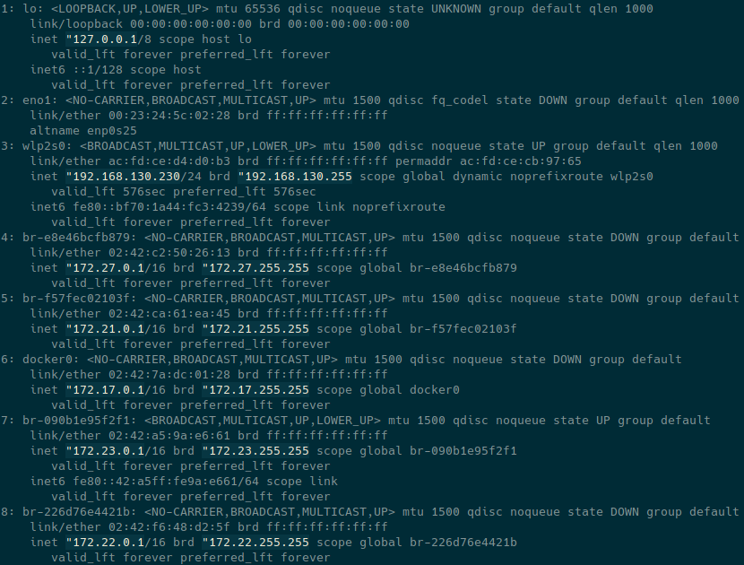
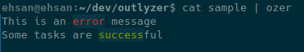

# Output analyzer (OZER)
You can specify a few words inside config.yaml file and specify the color you want to be used.
### installing:
Install command using `sudo sh install.sh`
this command will copy `ozer.py` and `config.yaml` to `/usr/bin`
### how to use?
```
your_command | ozer
```
that's it!

### How to customize your words?
Colors are: `aqua, blue, red, white, green, yellow, ping`

in `config.yaml` you can add blocks like this:
```yaml
block_name:
  words:
    - word1
    - word2
    - word3
  color:
    color_name
```
for example:
```yaml
my_words:
  words:
    - error
  color:
    red
```
Any time you changed `config.yaml` re-run `install.sh` to publish.

### How to catch IPs?
To catch IPs in the output simply set `ip: true` in config. It's very useful to analyze the out put of 'ip a' command.
For run `ip a | ozer` will result:


### Another sample here:



